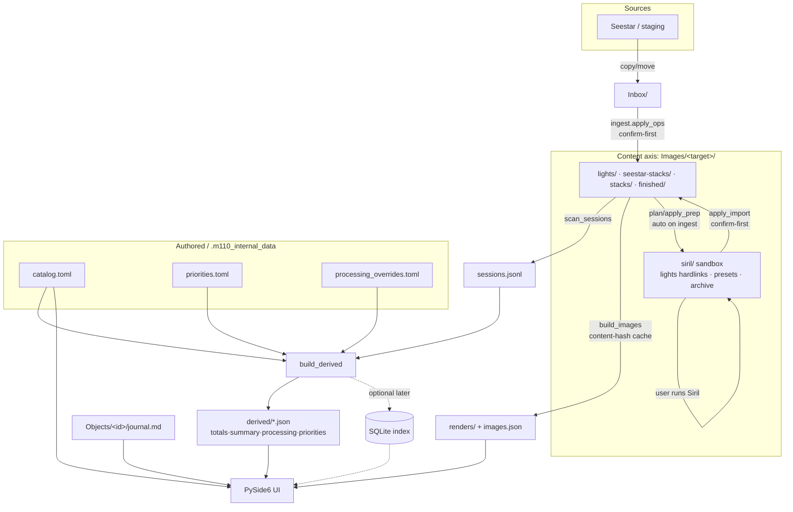

# M110 — Data Model

Canonical, human-readable description of M110's data: the entities in the
application, the files on disk, how each is derived, whether it's mutable, and how
long it lives. The goal is a model that is **scalable, logical, resource-efficient,
extensible, and discoverable** — so future use cases (multi-catalog goals, session
planning, multi-telescope ingest, an in-app assistant) come online without forced,
error-prone migrations.

> **This document is canonical.** Any change to the data model — on-disk layout,
> file formats, derived-JSON shapes, or the store version — **must** be recorded
> here. On-disk changes additionally bump `.store_version` and add a step in
> `migrate.py` (see [Versioning & migration](#versioning--migration)). See also
> [`ROADMAP.md`](ROADMAP.md) (where the model is headed) and [`BUGS.md`](BUGS.md)
> (open data items, e.g. #14/#16).

---

## Principles & invariants

These hold today and constrain every future change:

1. **Two visible content axes, kept distinct.** `Objects/` is the **catalog-object**
   axis (one folder per catalog object). `Images/` is the **capture-target** axis
   (one folder per thing the telescope was pointed at). They are separate because
   object ↔ target is **many-to-many**: one `M81 M82` capture feeds two catalog
   objects, and one object can be captured under several target folders.
2. **All machine state is hidden and disposable-by-design.** Everything the app
   generates or manages internally lives under the single hidden
   `.m110_internal_data/`. The user's irreplaceable data (images, notes) lives in
   the visible axes.
3. **Derived data is always regenerable** from content + authored files. Deleting
   anything under `derived/` or `renders/`, or `sessions.jsonl`, is safe — a
   Refresh rebuilds it. Nothing of value exists *only* in the derived layer.
4. **The content tree is written only via gated, confirm-first operations.**
   `ingest.apply_ops` and `siril.apply_import` are the only writers into `Images/`,
   and only after explicit user confirmation. Raws are never modified in place.
5. **Discoverability.** A human browsing the store on disk can find things from
   folder names alone — object ids, target names, and tier folders
   (`lights/`, `stacks/`, `finished/`, …) are self-describing.
6. **Engine stays Qt-free.** The data model is owned by the headless engine
   (`m110/*.py`); the UI only reads it. Path resolution is centralized in
   `config.py`.

---

## Entity hierarchy

```
Goal / List  (Messier, Caldwell, …)        ── many-to-many ──┐
   └─ membership of →                                        │
Catalog Object  (intrinsic: id, name, type, mag, size, coords, season, filter-rule)
   ├─ has one  Journal   (Objects/<id>/journal.md)
   └─ captured under ≥1 →                          ── many-to-many ──┘
Capture Target  (Images/<target>/ — what the scope pointed at; → ≥1 Object)
   └─ [Device]   (future path level: Images/<target>/<device>/ — the telescope)
        └─ Session   (one night for a target/device — derived from frame headers)
             └─ Frame   (one sub: light/dark/flat/bias; atomic, immutable;
                         FITS header OBJECT/IMAGETYP/FILTER/RA/DEC/EXP/DATE)
        └─ Stack   (device stack · Siril stack · finished render — derived images)
             └─ Render   (thumbnail / hero — a derivative of a stack or frame)
```

**Attribute / derivation flow** (how facts roll up):

```
Frame headers → Session rollup → Target rollup (totals.by_folder)
            → Object rollup (totals.by_slug, via the target↔object map)
            → Goal/List progress (by membership) → Summary (by category)
```

A Catalog Object is the source of truth for *intrinsic* facts. A Capture Target
holds the *observed* data. Rollups are derived, never authored.

---

## Store layout

Default root `~/Documents/M110` (override: `M110_DATA_ROOT` env → saved preference
→ default). Resolved in `config.py`; per-target paths come from
`config.{target,lights,stacks,seestar_stacks,finished,siril}_dir(name)`.

```
<data_root>/
  Objects/<catalog id>/             catalog-object axis (slug→id, e.g. Objects/M101/)
    journal.md                      frontmatter (name/hero_caption/hero) + Markdown body
  Images/<target>/                  capture-target axis (e.g. Images/"M81 M82"/)
    lights/                         raw light subs (.fit)                 [immutable]
    stacks/                         Siril stacks (.fit/.tif)              [output]
    seestar-stacks/                 device in-app stacks (+ preview .jpg) [output]
    finished/                       hand-finished renders                 [output]
    siril/                          contained processing-prep sandbox:
      lights/ (hardlinks) · process/ (scratch) · presets/ · next-steps.md
      archive/<ts>/ (past runs)
    (darks/ flats/ biases/ preserved if present)
  Media/<Category>_photo|_video/    lunar/planetary/scenery media
  Inbox/                            staging area for ingest
  .m110_internal_data/              hidden machine state (README: "don't touch")
    catalog.toml                    object catalog {slug:{id,name,type,…,ra_deg,dec_deg}}
    priorities.toml                 priority targets ([[priority]]; optional track=false)
    processing_overrides.toml       per-folder status overrides ([folder.<name>])
    ingest_aliases.toml             source-name → canonical-target aliases
    sessions.jsonl                  one capture session per line (generated)
    journal_template.md             reference journal format (stubs generated from it)
    derived/                        generated rollups: totals/summary/processing/
                                    priorities/images.json
    renders/                        generated thumbnails + hero/<slug>.jpg
    .store_version                  layout version stamp (= 2)
```

App-bundled **reference data** (ships in the package, not in the store):
`m110/seed/{catalog,priorities}.toml`, `m110/seed/coords.csv` (J2000 ref coords),
`m110/guidance/*.md` (workflow playbooks).

---

## Data catalog

Lifecycle classes: **Authored** (user-owned, mutable) · **Content** (precious;
raws immutable) · **Derived** (regenerable, disposable) · **Reference**
(app-bundled, read-only).

| Entity / file | Location | Format | Derived / discovered | Mutability (enforcement) | Persistence | Retention / cleanup |
|---|---|---|---|---|---|---|
| Object catalog | `.m110_internal_data/catalog.toml` | TOML | Seeded from `seed/`; extended by `catalog.add_captured_objects` (captured-but-uncatalogued → minimal entry + Simbad coords) | **Mutable** — user-editable; app appends additively, never overwrites (convention) | Persistent | Never auto-deleted |
| Priorities | `.m110_internal_data/priorities.toml` | TOML (`[[priority]]`) | Hand-authored; joined with totals in `build_derived` | **Mutable** — user-owned | Persistent | Never auto-deleted |
| Journal | `Objects/<id>/journal.md` | Markdown + YAML-ish frontmatter | Stub generated per catalog object from `journal_template.md`; body authored by user | **Mutable** — user-owned; app upserts only frontmatter keys (`objects.set_frontmatter_key`, e.g. hero) | Persistent | Never auto-deleted |
| Processing overrides | `.m110_internal_data/processing_overrides.toml` | TOML (`[folder.<name>]`) | Authored (e.g. dismiss a folder) | **Mutable** — user-owned | Persistent | Never auto-deleted |
| Ingest aliases | `.m110_internal_data/ingest_aliases.toml` | TOML (`[alias]`) | Written by the ingest "remember" action (`ingest.add_alias`) | **Mutable** — app-written, user-editable | Persistent | Never auto-deleted |
| Light frames | `Images/<target>/lights/*.fit` | FITS | Ingested from device/staging (`ingest.apply_ops`) | **Immutable** — engine never writes into `lights/`; ingest writes bytes-only to `.part` then atomic `os.replace` (convention) | Persistent | Never auto-deleted |
| Calibration frames | `Images/<target>/{darks,flats,biases}/` | FITS | Preserved if present | **Immutable** (convention) | Persistent | Never auto-deleted |
| Siril stacks | `Images/<target>/stacks/` | FITS/TIFF | Imported from the siril sandbox (`siril.apply_import`) | **Output** — replaceable by re-import | Persistent | Never auto-deleted |
| Seestar stacks | `Images/<target>/seestar-stacks/` | FITS (+ preview .jpg) | Ingested from device | **Output** | Persistent | Never auto-deleted |
| Finished renders | `Images/<target>/finished/` | PNG/JPG/TIFF/FITS | Imported from the siril sandbox | **Output** — user's deliverables | Persistent | Never auto-deleted |
| Siril sandbox | `Images/<target>/siril/` | mixed | `siril.plan/apply_prep` (auto on ingest; missing-only backfill on refresh) | **Working area** — app-managed; `lights/` are hardlinks (no extra space) | Persistent (ready for re-runs) | `archive/<ts>/` accumulates; **never auto-deleted** (see Retention) |
| Media | `Media/<Category>_photo\|_video/` | images/video | Ingested (`*_photo`/`*_video`) | **Content** | Persistent | Never auto-deleted |
| Sessions index | `.m110_internal_data/sessions.jsonl` | JSONL (1 session/line) | `scan_sessions.scan()` over `lights/` FITS headers | **Derived** | Regenerable | Safe to delete; rebuilt on Refresh |
| Rollups | `.m110_internal_data/derived/*.json` | JSON | `build_derived` (totals/summary/processing/priorities), `build_images` (images) | **Derived** | Regenerable | Safe to delete; rebuilt on Refresh (`processing.json` stamps `generated_at` and is intentionally not byte-stable) |
| Renders cache | `.m110_internal_data/renders/` | JPG/PNG | `build_images` (content-hash cached: mtime+size+ver) | **Derived** | Regenerable | Safe to delete; **orphans should be pruned** (open #14) |
| Store version | `.m110_internal_data/.store_version` | text (`2`) | Written by `migrate.py`/bootstrap | **App-managed** | Persistent | Bumped on layout change |
| Bundled catalog/priorities/coords | `m110/seed/` | TOML/CSV | Shipped with the app | **Reference** (read-only) | Persistent (in package) | n/a |
| Guidance playbooks | `m110/guidance/*.md` | Markdown | Shipped with the app | **Reference** (read-only) | Persistent (in package) | n/a |

**Status vocabularies** (computed, not stored): capture status `initial` /
`deep_stack` (by integration; `totals`); processing status `not_processed` /
`out_of_date` / `up_to_date` / `dismissed` (`processing`). Summary categories come
from the catalog object `type`.

---

## Mutability & enforcement policy

Today enforcement is **by convention + in-app handling**, not filesystem
permissions — this keeps the store cross-platform and friction-free, and the engine
is the only writer:

- The engine **never writes into `lights/`** (or other raw tiers). Ingest copies
  **bytes only** to a `.part` temp then `os.replace()` (atomic; no partial files;
  also avoids the EPERM `copystat` issue over SMB).
- Catalog/journal writes are **additive/upsert** and never clobber user edits.
- The content tree is mutated only by the two gated writers (ingest, import).

**Optional future hardening** (not implemented; the model permits it): mark
`lights/` read-only at the filesystem level; maintain a checksum manifest of raws
for integrity verification.

## Retention / lifecycle

- **Raws, stacks, finished, media** — persistent; **never auto-deleted**.
- **Siril sandbox** — `lights/` are hardlinks (free); after an import the run's
  intermediates move into `siril/[<FILTER>/]archive/<ts>/` and the sandbox is left
  ready for the next run. `archive/` is **retained by default** ("never delete").
  Any future pruning (keep-N-latest / age-based) must be **user-gated and explicit**
  — never automatic.
- **Renders cache** — pure cache; orphaned derivatives (from reprocessed sources
  with new content hashes) are safe to remove. Automatic orphan-pruning is the
  first concrete retention task (open **#14**).
- **Derived JSON + `sessions.jsonl`** — regenerable; safe to delete anytime
  (rebuilt on Refresh).

## Versioning & migration

`.store_version` (currently **2**) stamps the on-disk layout.
`config.ensure_data_root()` runs `migrate.migrate_store()` on launch. Migrations
are **idempotent, version-stamped, same-filesystem renames, resume-safe, and never
destructive**. **Rule:** any change to the on-disk layout or file formats bumps the
version and adds a migration step that brings older stores forward in place.

---

## Data flow



> **Viewing the diagram (macOS, free/OSS):** the embedded Mermaid renders directly
> on GitHub. Locally, the simplest is **VS Code + the "Markdown Preview Mermaid
> Support" extension** (open the Markdown preview). Zero-install: paste the block
> into the **Mermaid Live Editor** (mermaid.live). To export an image, use
> **mermaid-cli** (`@mermaid-js/mermaid-cli`): `mmdc -i DATA_MODEL.md -o flow.svg`.
> **MarkText** (free, OSS editor) also renders Mermaid natively.

---

## Future directions (designed for, not yet built)

The model is shaped to accommodate the next ROADMAP phases **without a disruptive
migration**. These are intentionally *not* implemented yet; this section records
the chosen direction so future work builds to it.

### Multi-catalog "goals" (ROADMAP item 5)
- `catalog.toml` becomes the **global object catalog** — *intrinsic* facts only
  (id, name, type, magnitude, size, coords, season, filter-rule, notes). One entry
  per object, the single source of truth.
- **Goals/lists** (Messier, Caldwell, Herschel 400, RASC Finest, …) are **separate
  definitions** that reference objects by id — many-to-many membership (the Veil is
  both a non-Messier add *and* Caldwell C33/C34). Proposed home:
  `.m110_internal_data/lists/<list>.toml` with
  `{id, name, description, members:[object ids], optional per-member target/order}`.
- `build_derived` computes **per-list progress**. Today's implicit "Messier" goal =
  the seeded catalog membership until explicit list defs land. Priorities become a
  special list or stay separate — to be decided when built.

### Multi-telescope ingest (BUGS #16)
- A **device path level under the target**:
  `Images/<target>/<device>/{lights,stacks,seestar-stacks,finished,siril}/`.
- Today's flat `Images/<target>/…` = an implicit **default device** (the Seestar
  S50); migration is lazy/optional and the absence of a device level means the
  default device.
- The `<device>` id is a **device-profile key** (links to the planning profiles
  below). Classification will lean on FITS headers, not just folder names.

### Session planning & plan files (ROADMAP items 1–2)
- **Profiles** — observing **site**, **equipment/device**, and **horizon mask**
  (`.hrz`) — are authored config under `.m110_internal_data/` (proposed
  `profiles/`).
- **Generated plan files** (SSC schedule JSON, NINA sequences) are user-facing
  **outputs** → proposed visible `Plans/` axis (sibling to `Media/`). Homes are
  proposed; refine when built.

### Storage substrate seam
- Human-readable files (TOML/JSONL/MD) remain the **source of truth**; the
  **derived layer** is the single heavy-query path and is **swappable**. A future
  **SQLite index** is just another derived artifact built by `build_derived` and
  read by `derived.py` — content files are never queried directly at scale. This
  keeps "scalable & efficient" reachable without changing the on-disk content
  model.
