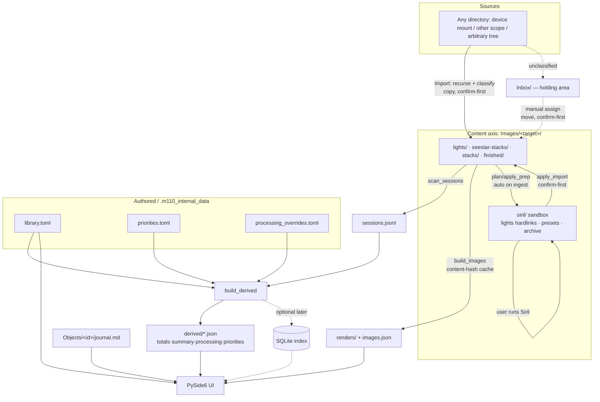

# M110 — Data Model

Canonical, human-readable description of M110's data: the entities in the
application, the files on disk, how each is derived, whether it's mutable, and how
long it lives. The goal is a model that is **scalable, logical, resource-efficient,
extensible, and discoverable** — so future use cases (multi-catalog goals, session
planning, multi-telescope ingest, an in-app assistant) come online without forced,
error-prone migrations.

> **This document is canonical.** Any change to the data model — on-disk layout,
> file formats, derived-JSON shapes, or the store version — **must** be recorded
> here. On-disk changes additionally bump `.store_version` and add a step in
> `migrate.py` (see [Versioning & migration](#versioning--migration)). See also
> [`ROADMAP.md`](ROADMAP.md) (where the model is headed) and [`BUGS.md`](BUGS.md)
> (open data items, e.g. #14/#16).

---

## Principles & invariants

These hold today and constrain every future change:

1. **Two visible content axes, kept distinct.** `Objects/` is the **catalog-object**
   axis (one folder per catalog object). `Images/` is the **capture-target** axis
   (one folder per thing the telescope was pointed at). They are separate because
   object ↔ target is **many-to-many**: one `M81 M82` capture feeds two catalog
   objects, and one object can be captured under several target folders.
2. **All machine state is hidden and disposable-by-design.** Everything the app
   generates or manages internally lives under the single hidden
   `.m110_internal_data/`. The user's irreplaceable data (images, notes) lives in
   the visible axes.
3. **Derived data is always regenerable** from content + authored files. Deleting
   anything under `derived/` or `renders/`, or `sessions.jsonl`, is safe — a
   Refresh rebuilds it. Nothing of value exists *only* in the derived layer.
4. **The content tree is written only via gated, confirm-first operations.**
   `ingest.apply_ops` and `siril.apply_import` are the only writers into `Images/`,
   and only after explicit user confirmation. Raws are never modified in place.
5. **Discoverability.** A human browsing the store on disk can find things from
   folder names alone — object ids, target names, and tier folders
   (`lights/`, `stacks/`, `finished/`, …) are self-describing.
6. **Engine stays Qt-free.** The data model is owned by the headless engine
   (`m110/*.py`); the UI only reads it. Path resolution is centralized in
   `config.py`.

---

## Entity hierarchy

```
Goal / List  (Messier, Caldwell, …)        ── many-to-many ──┐
   └─ membership of →                                        │
Catalog Object  (intrinsic: id, name, type, mag, size, coords, season, filter-rule)
   ├─ has one  Journal   (Objects/<id>/journal.md)
   └─ captured under ≥1 →                          ── many-to-many ──┘
Capture Target  (Images/<target>/ — what the scope pointed at; → ≥1 Object)
   └─ [Device]   (future path level: Images/<target>/<device>/ — the telescope)
        └─ Session   (one night for a target/device — derived from frame headers)
             └─ Frame   (one sub: light/dark/flat/bias; atomic, immutable;
                         FITS header OBJECT/IMAGETYP/FILTER/RA/DEC/EXP/DATE)
        └─ Stack   (device stack · Siril stack · finished render — derived images)
             └─ Render   (thumbnail / hero — a derivative of a stack or frame)
```

**Attribute / derivation flow** (how facts roll up):

```
Frame headers → Session rollup → Target rollup (totals.by_folder)
            → Object rollup (totals.by_slug, via the target↔object map)
            → Goal/List progress (by membership) → Summary (by category)
```

A Catalog Object is the source of truth for *intrinsic* facts. A Capture Target
holds the *observed* data. Rollups are derived, never authored.

**Framings.** One object can be shot in ways that don't combine: a mosaic of M42
is M42's sky, but its frames don't stack with a single-frame capture of it.
Summing them into one integration would claim a depth no single stack has — and
could promote an object past the deep-stack threshold neither framing reaches. So
the object rollup counts the **plain** capture targets, and a *decorated* target
(`M42_mosaic`, recognised by `scan_sessions.is_decorated_target`) is tracked
beside it: `totals.by_slug[slug].framings` maps each contributing target to
`{counted, frames, integration_min, session_count}`. An object captured *only* as
a mosaic has nothing to conflate it with, so that framing is counted — it is the
capture. Combined targets (`M81 M82`) are one dataset containing both objects and
are unaffected: they count for each member as before.

---

## Store layout

Default root `~/Documents/M110` (override: `M110_DATA_ROOT` env → saved preference
→ default). Resolved in `config.py`; per-target paths come from
`config.{target,lights,stacks,seestar_stacks,finished,siril}_dir(name)`.

```
<data_root>/
  Objects/<catalog id>/             catalog-object axis (slug→id, e.g. Objects/M101/)
    journal.md                      frontmatter (name/hero_caption/hero) + Markdown body
  Images/<target>/                  capture-target axis (e.g. Images/"M81 M82"/)
    lights/                         raw light subs (.fit/.fits)           [immutable]
    rejected/                       subs the user excluded from processing (#110;
                                    user-created, lazily) — same frames, out of the
                                    population: not linked into a sandbox, not counted
                                    as integration, never re-imported [immutable]
    stacks/                         Siril stacks (.fit/.tif)              [output]
    seestar-stacks/                 device in-app stacks (+ preview .jpg) [output]
                                    (generic on-device stack tier: Seestar
                                    Stacked_*, Dwarf stacked-16_*, …)
    finished/                       hand-finished renders                 [output]
    previews/                       optional per-sub JPG previews (#25; opt-in) [archive]
    working_files/                  processing by-products (starless/crop/…) [output]
    siril/                          contained processing-prep sandbox:
      lights/ (hardlinks) · darks/ flats/ biases/ (hardlinks, shared, if present) ·
      process/ (scratch) · presets/ · next-steps.md · archive/<ts>/ (past runs)
    astrowizard/                    contained AstroWizard sandbox (ROADMAP item 14):
      the handed-off stack + its `<stack>.src.json` provenance sidecar
      ({source, size_bytes, stacked_at, frames, integration_sec, object, filter,
      stretched} — every field read from the stack's own header, never mtime,
      which is copy time for anything ingest or import placed) · the user's exports ·
      archive/<ts>/ (past runs). A **sibling** of siril/, not a subdir: these dirs
      name *workflows*, and the two artifacts have different lifetimes (a stack
      costs hours and is stable, a finish is cheap and iterated), so sharing one
      dir would archive the expensive one on every re-finish. Written by
      `m110-stack --handoff` / the app's send-stack flow; lazily created,
      additive → no .store_version bump                          [output]
    ⚠ Every sandbox dirname above is a key of **`config.SANDBOX_LINKED_INPUTS`**, the
      single authority; `SANDBOX_DIRNAMES` is derived from it and read by
      `siril._ROOT_SKIP_DIRS`, `ingest._SKIP_DIRS` and `backup.scope.is_excluded`.
      A new workflow is added there and nowhere else — omitting it from any one of
      the three fails silently (the other workflow claims the output / ingest
      re-imports it / it lands in every snapshot).
      Its **value** is which of the workflow's subdirectories hold hardlinks to
      frames the store already has (`siril` → lights/darks/flats/biases;
      `astrowizard` → none, its input is a single handed-off file). Backup skips
      exactly those and keeps the rest — see *Backup* below for why each direction
      of getting this wrong is costly and silent.
    (darks/ flats/ biases/ — calibration; preserved if present, and **import targets**
                            for frames header-routed by IMAGETYP (ROADMAP item 6b);
                            written by ingest, layout unchanged → no .store_version bump)
  Media/<Category>_photo|_video/    lunar/planetary/scenery media (e.g. Dwarf
                                    startrails → Startrails_video/ + _photo/).
                                    Scanned **recursively**, and each file's kind
                                    comes from its own extension — so a stacked
                                    `.jpg`/`.fit` result sitting in a `_video/`
                                    folder (or a nested processing-output subdir)
                                    is listed as a photo, not hidden.
                                    `<stem>_thn.jpg` beside a **video** is the
                                    device's poster frame and is **load-bearing**
                                    (the UI's only still for that clip); beside a
                                    **photo** it is a redundant duplicate and is
                                    neither imported nor listed.
  Inbox/                            holding area / import queue (transient): unclassifiable
                                    files (`ingest.scan_holding`) await **manual assign**
                                    (`ingest.assign` → move into the content tree, 6c);
                                    no longer a user-facing import *source*
  Plans/<date>_<slug>.md            saved session-plan **field guides** (Markdown; Checkpoint B,
                                    `m110/fieldguide.py`) — a visible axis sibling to Media/,
                                    created idempotently by `ensure_data_root` (additive
                                    external output → no .store_version bump)
  .m110_internal_data/              hidden machine state (README: "don't touch")
    library.toml                    the user's Library = captured/annotated collection {slug:{id,name,type,…}} (starts empty)
    goals.toml                      per-store goals: active = [...] (default ["messier"]) + [[custom]] lists
    priorities.toml                 priority targets ([[priority]]; optional track=false)
    pins.toml                       manual Pin/Deprioritize overrides ([pins] slug="pin"|"deprioritize"; lazily created,
                                    additive → no .store_version bump; absence = no overrides)
    assistant/                      the AI assistant's outbox (lazily created, additive → no .store_version
      README.md                     bump). outbox/ is THE ONLY PLACE an assistant tool may create a file, and
      outbox/                       it may only create — never modify or delete. Holds drafted field guides
                                    (*.md) and staged m110.proposal/v1 envelopes (*.json) until the user
                                    accepts them in the app. Nothing here is authoritative: the store reads
                                    none of it, so it is excluded from backups and safe to delete
    processing_overrides.toml       per-folder status overrides ([folder.<name>])
    ingest_aliases.toml             source-name → canonical-target aliases
    sessions.jsonl                  one capture session per line (generated)
    journal_template.md             reference journal format (stubs generated from it)
    derived/                        generated rollups: totals/summary/processing/
                                    priorities/images.json
                                    (images.json per-image record: name/label/size_mb/mtime/
                                     viewable + `thumb` (render filename) + `full` (displayable
                                     full-size raster, data-root-relative; None for FITS) +
                                     `src` (the **actual source file**, data-root-relative, set
                                     for every image — what Reveal/Open/Export act on).
                                     Regenerated by every refresh → no .store_version bump)
    renders/                        generated thumbnails + hero/<slug>.jpg
    .store_version                  layout version stamp (= 4)
```

App-bundled **reference data** (ships in the package, not in the store):
`m110/seed/objects.toml` (object **reference** dataset incl. J2000 coords),
`m110/seed/priorities.toml`, `m110/seed/catalogs/*.toml` (bundled catalog membership lists).

---

## Data catalog

Lifecycle classes: **Authored** (user-owned, mutable) · **Content** (precious;
raws immutable) · **Derived** (regenerable, disposable) · **Reference**
(app-bundled, read-only).

| Entity / file | Location | Format | Derived / discovered | Mutability (enforcement) | Persistence | Retention / cleanup |
|---|---|---|---|---|---|---|
| Library | `.m110_internal_data/library.toml` | TOML | The user's **captured/annotated collection** (5d) — **starts empty**; grows by capture (`catalog.add_captured_objects`: known objects pull full reference metadata, off-catalog ones get a minimal entry + Simbad coords), the Add-object flow, or annotation. Uncaptured catalog members live in Goals, not here. Per-entry optional **`publish`** flag (item 8a): absent/`true` = published, `false` = excluded from the published site (`catalog.set_publish_flag`, default-publish opt-out) | **Mutable** — user-editable; app appends additively, never overwrites (convention); `remove_library_entry` / goal-deselect prune; `set_publish_flag` in-place rewrite | Persistent | Never auto-deleted |
| Object reference | `m110/seed/objects.toml` | TOML | Shipped with the app | **Reference** (read-only) | Persistent (in package) | n/a |
| Catalog lists | `m110/seed/catalogs/*.toml` | TOML | Shipped with the app: standard catalogs Messier, Caldwell, RASC Finest NGC, Best of Sharpless, Bennett, Lacaille (gen by `tools/gen_caldwell.py` + `tools/gen_catalogs.py`) + three **hand-curated** popularity/device lists — `popular-deep-s50`, `popular-widefield`, `popular-bright` (device-tier × FOV-fit, all-season; members must resolve to the object reference — enforced by `tests/test_goals.py`) | **Reference** (read-only) | Persistent (in package) | n/a |
| Goals | `.m110_internal_data/goals.toml` | TOML | The catalogs/lists this store is pursuing: `active = [...]` (bundled catalog ids + custom goal ids; default `["messier"]`) plus `[[custom]]` blocks (`id`, `name`, `members = [slugs]`); **per-store** | **Mutable** — app-written (`goals.set_active_goals` / `create_custom_goal` / `edit_custom_goal` / `delete_custom_goal`); reconstructible | Persistent | Never auto-deleted |
| Priorities | `.m110_internal_data/priorities.toml` | TOML (`[[priority]]`) | Hand-authored; joined with totals in `build_derived` | **Mutable** — user-owned | Persistent | Never auto-deleted |
| Pins | `.m110_internal_data/pins.toml` | TOML (`[pins]` slug→`"pin"`\|`"deprioritize"`; legacy `"mute"` read-mapped) | Manual Pin/Deprioritize priority overrides (#3); app-written (`pins.set_state`); lazily created, additive (no `.store_version` bump), **survives derived regeneration** | **Mutable** — user-owned | Persistent | Never auto-deleted |
| Journal | `Objects/<id>/journal.md` | Markdown + YAML-ish frontmatter | Stub generated per catalog object from `journal_template.md`; body authored by user. Optional **`private: true`** frontmatter key (item 8a) keeps this object's notes out of the published site | **Mutable** — user-owned; app upserts only frontmatter keys (`objects.set_frontmatter_key`, e.g. hero) | Persistent | Never auto-deleted |
| Published site | external (user-chosen folder, e.g. `~/Documents/M110 Site`) | static HTML/CSS/JS + image derivatives | Generated by `publish.run_publish` (item 8a) from derived JSON + `build_images` + journals; **outside the data store** (not under `<data_root>`, no `.store_version` impact) | **Output artifact** — fully regenerated each publish; user/host owns it | Transient (re-rendered) | User-managed |
| Processing overrides | `.m110_internal_data/processing_overrides.toml` | TOML (`[folder.<name>]`) | Authored (e.g. dismiss a folder) | **Mutable** — user-owned | Persistent | Never auto-deleted |
| Ingest aliases | `.m110_internal_data/ingest_aliases.toml` | TOML (`[alias]`) | Written by the ingest "remember" action (`ingest.add_alias`) | **Mutable** — app-written, user-editable | Persistent | Never auto-deleted |
| Light frames | `Images/<target>/lights/*.fit`/`*.fits` | FITS | Ingested from device/staging (`ingest.apply_ops`) | **Immutable** — engine never writes into `lights/`; ingest writes bytes-only to `.part` then atomic `os.replace` (convention) | Persistent | Never auto-deleted |
| Rejected subs | `Images/<target>/rejected/` | FITS | **User-created** — the user moves a sub here by hand to exclude it (#110); import routes one here only when the *source* store already filed it so (kind `rejected`) | **Immutable** — same posture as `lights/`; the engine only ever *reads* the names, and unlinks the sandbox hardlink that pointed at the frame (`siril.prune_rejected`), never the frame | Persistent | Never auto-deleted. Lazily created; every consumer of subs already read `lights/` and nothing else, so moving a frame here drops it from prep, sessions and integration for free. Import treats `lights/`+`rejected/` as **one population** (`ingest._light_tier_names`), which is what stops the telescope re-syncing it — the reason to move rather than delete. Additive → **no `.store_version` bump** |
| Calibration frames | `Images/<target>/{darks,flats,biases}/` | FITS | Preserved if present | **Immutable** (convention) | Persistent | Never auto-deleted |
| Siril stacks | `Images/<target>/stacks/` | FITS/TIFF | Imported from the siril sandbox (`siril.apply_import`) | **Output** — replaceable by re-import | Persistent | Never auto-deleted |
| Device stacks | `Images/<target>/seestar-stacks/` | FITS (+ preview .jpg) | Ingested from device — the generic on-device/in-app stack tier (Seestar `Stacked_*`, Dwarf `stacked-16_*` + `stacked.jpg`) | **Output** | Persistent | Never auto-deleted |
| Finished renders | `Images/<target>/finished/` | PNG/JPG/TIFF/FITS | Imported from the siril sandbox | **Output** — user's deliverables | Persistent | Never auto-deleted |
| Working files | `Images/<target>/working_files/` | FITS (mostly) | Diverted here on import when a `.fit` in a lights source reads as a processing by-product, not a raw sub (`config.is_light_frame`/`is_processing_product`); `ingest.plan_lights_cleanup` relocates already-mis-filed ones | **Output** — kept, not raw | Persistent | Never auto-deleted | Keeps `lights/` sub-only (raw-integrity + correct filter detection) and `finished/` for final renders only |
| Sub previews | `Images/<target>/previews/` | JPG | **Opt-in** (#25, `import_sub_previews` pref, default off): the Seestar's per-sub `.jpg` beside every raw sub, routed here by the `_sub` classifier (kind `preview`) instead of being ignored | **Archive** — user's copies, review-only | Persistent | Never auto-deleted | Lazily created (only when the pref is on + previews present); kept out of `lights/` and out of the gallery/hero tiers → **no `.store_version` bump** |
| Siril sandbox | `Images/<target>/siril/` | mixed | `siril.plan/apply_prep` (auto on ingest; missing-only backfill on refresh) | **Working area** — app-managed; `lights/` (and `darks/flats/biases/` when present, #57) are hardlinks (no extra space); the preset's calibration toggles follow | Persistent (ready for re-runs) | `archive/<ts>/` pruned keep-N-latest (default 3, `processing_archive_keep`; "all" = never delete) — see Retention |
| Media | `Media/<Category>_photo\|_video/` | images/video | Ingested (`*_photo`/`*_video`) | **Content** | Persistent | Never auto-deleted | Import copies content files **plus** a video's `<stem>_thn.jpg` poster; photo-side `_thn.` duplicates and `.avi.idx`/`.avi.txt` are no longer copied (Tools → Clean up imported sidecars removes ones already on disk — never a live video poster) |
| Media posters | `.m110_internal_data/renders/media/` | JPG | `media.poster_for` → `build_images.make_thumb`, for photo formats Qt can't decode (FITS) | **Derived** | Regenerable | Safe to delete. A **subdirectory** on purpose: `build_images._cleanup_orphaned_renders` reaps unreferenced `*.jpg` directly in `renders/`, and `images.json` never names Media files — the same protection `hero/` relies on |
| Sessions index | `.m110_internal_data/sessions.jsonl` | JSONL (1 session/line) | `scan_sessions.scan()` over `lights/` FITS headers | **Derived** | Regenerable | Safe to delete; rebuilt on Refresh. Each row carries `date` (the **observing night's label**) plus `first_obs`/`last_obs` (the segment's real **UTC** `DATE-OBS` window) — see the note below |
| Rollups | `.m110_internal_data/derived/*.json` | JSON | `build_derived` (totals/summary/processing/priorities), `build_images` (images) | **Derived** | Regenerable | Safe to delete; rebuilt on Refresh (`processing.json` stamps `generated_at` and is intentionally not byte-stable) |
| Renders cache | `.m110_internal_data/renders/` | JPG/PNG | `build_images` (content-hash cached: mtime+size+ver) | **Derived** | Regenerable | Safe to delete; **orphans should be pruned** (open #14) |
| Store version | `.m110_internal_data/.store_version` | text (`4`) | Written by `migrate.py`/bootstrap | **App-managed** | Persistent | Bumped on layout change |
| Bundled catalog/priorities/coords | `m110/seed/` | TOML/CSV | Shipped with the app | **Reference** (read-only) | Persistent (in package) | n/a |

**Status vocabularies** (computed, not stored): capture status `initial` /
`deep_stack` (by integration; `totals`); processing status `not_processed` /
`out_of_date` / `up_to_date` / `dismissed` (`processing`). Summary categories come
from the catalog object `type`.

**Processing freshness & rejection are judged by capture date, not file mtime.**
`build_processing` compares each session's **capture date** (from the FITS header,
via `scan_sessions`) against the latest stack's FITS **`DATE`**: frames shot after
the stack are the unintegrated backlog → `out_of_date`; a stack that already covers
everything captured → `up_to_date`. Rejection% (`stack_meta.stack_rejection_pct`) is
`1 − STACKCNT / frames_at_stack`, where `frames_at_stack` (also emitted in
`stack_meta`) is the frames **present when the stack was made** — *not* the running
capture total (which would miscount later frames as "rejected"). This is robust to a
bulk import flattening file mtimes (e.g. the Astronomy port). When no stack `DATE` is
available (finished-render-only, or a header lacking `DATE`), it falls back to the
newest-light-vs-newest-processed mtime comparison.

**A session's `date` is a night label, not a calendar day — compare on
`first_obs`/`last_obs`.** `scan_sessions` buckets subs by observing night, so
frames exposed after local midnight keep the *previous* evening's label: a session
dated `2026-08-17` can consist entirely of frames stamped `2026-08-18T03:41Z`.
Comparing that label against a stack's calendar date is comparing two different
kinds of thing, and it reported 202 unintegrated frames as "up to date" (while
inflating rejection from 5% to 72%, since the backlog landed in the denominator).
Each row therefore also carries **`first_obs`/`last_obs`** — the segment's earliest
and latest `DATE-OBS`, in **UTC**, directly comparable with the stack's `DATE`.
Both come from **headers**, never the filename: device filenames timestamp the same
moment in *local* time (`…_20260816-221509.fit` is `2026-08-17T04:14Z`), and that
offset is invisible until the two are compared. `scan_sessions` reads two headers
per session-segment (the first and last sub by name — names order the frames,
headers date them), so the cost is per session, not per frame. A segment straddling
the stack instant counts wholly as backlog; rows predating these fields fall back to
the day comparison until the next Refresh rewrites them.

---

## Mutability & enforcement policy

Today enforcement is **by convention + in-app handling**, not filesystem
permissions — this keeps the store cross-platform and friction-free, and the engine
is the only writer:

- The engine **never writes into `lights/`** (or other raw tiers). Ingest copies
  **bytes only** to a `.part` temp then `os.replace()` (atomic; no partial files;
  also avoids the EPERM `copystat` issue over SMB).
- Catalog/journal writes are **additive/upsert** and never clobber user edits.
- The content tree is mutated only by the two gated writers (ingest, import).

**Optional future hardening** (not implemented; the model permits it): mark
`lights/` read-only at the filesystem level; maintain a checksum manifest of raws
for integrity verification.

## Retention / lifecycle

- **Raws, stacks, finished, media** — persistent; **never auto-deleted**.
- **Workflow sandboxes** — `siril/`'s `lights/` are hardlinks (free); after an
  import the run's intermediates move into `<sandbox>/[<FILTER>/]archive/<ts>/` and
  the sandbox is left ready for the next run.

  **Policy changed (14b): `archive/` is now pruned, keep-N-latest, on by default
  at N=3.** This supersedes the earlier commitment that pruning would be
  "user-gated and explicit — never automatic". Two things forced it. Archived runs
  only accumulate — nothing regenerates or replaces them — and a real library
  reached **42 GB across 36 archive dirs**, all of it inside the backup scope, so
  "never delete" was not a neutral default but a slow leak. And AstroWizard turns
  a single finish into ~2 GB of per-step autosaves, so the growth rate per run rose
  sharply with the second workflow.

  The guarantees that remain are the ones that matter: the **most recent run is
  never deleted**, only directories whose *name* parses as the `%Y%m%d-%H%M%S`
  stamp are candidates (so a folder the user put in `archive/` is untouchable),
  ordering is by that name and never by mtime, pruning happens **only** on an
  import that actually archived (never on refresh, never on "leave the sandbox
  as-is"), and setting the preference to **"all" restores the old behaviour
  exactly**. `roundtrip.prune_archives` is the only implementation.
- **Renders cache** — pure cache; orphaned derivatives (from reprocessed sources
  with new content hashes) are safe to remove. Automatic orphan-pruning is the
  first concrete retention task (open **#14**).
- **Derived JSON + `sessions.jsonl`** — regenerable; safe to delete anytime
  (rebuilt on Refresh).

## Backup

`m110/backup/` (ROADMAP item 10) writes the store to a user-chosen destination
**outside** `<data_root>`. Scope is a **denylist** aligned with the lifecycle classes
above: everything is backed up **except** the regenerable Derived tier (`derived/`,
`renders/`, `sessions.jsonl`), the assistant outbox, and a workflow sandbox's
**linked inputs**.

That last one is narrower than it once was. A sandbox is *not* excluded wholesale:
only the subdirectories declared in **`config.SANDBOX_LINKED_INPUTS`** — the
hardlink trees (`siril/lights/`, `siril/<FILTER>/lights/`, and the calibration
links beside them) whose bytes are already in the snapshot under
`Images/<target>/lights/`. Everything else a sandbox holds is backed up:
`archive/<ts>/` past runs, hand-edited presets, `next-steps.md`, another
workflow's exports. Excluding those was a mistake of category — they are not
regenerable in the sense the rest of the denylist means, since nothing but the
user redoing hours of stretching, star removal and colour work produces them
again, and the finished deliverable that *is* imported to `finished/`/`stacks/`
does not carry its intermediates.

The distinction is worth stating precisely because the two halves fail in
opposite directions. Keeping the link trees in is expensive and silent: the
mirrored format dedups by *relative path*, so `Images/M42/siril/lights/x.fit` and
`Images/M42/lights/x.fit` are unrelated keys and both get stored — measured on a
real library at **+139 GB against 186 GB backed up**, near enough to double,
while adding no recoverable information. Leaving the authored work out is cheap
and silent in the other direction: **+39 GB (+21%)** on the same library, and the
user only discovers the gap when they go looking for a run they wanted back.

There are **two snapshot formats**, and both are always listable, verifiable and
restorable at the same destination. Which one a new backup uses is resolved from
the destination itself (`backup.resolve_format`): what's already there wins, else
the `backup_format` preference, unless the filesystem can't hardlink — then pooled,
necessarily. Their namespaces are provably disjoint (mirrored snapshots are
directories whose *names* parse as a timestamp; `objects/`, `snapshots/`, `latest/`
never will), so they coexist with no flag day and no conversion.

**Mirrored** (default) — `<dest>/M110-Backups/<store-name>/<timestamp>/` mirrors the
store, with files unchanged since the previous snapshot hardlinked to it (immutable
raws cost nothing to keep across snapshots). Per-snapshot
`.m110-backup-manifest.json`: metadata + `files: {rel: {size, mtime, sha256}}`.
A snapshot needs no software to restore — it *is* the files, in the right folders.

**Pooled** — for destinations that can't hardlink (a share or filesystem where
mirrored would silently store a *full copy* every run — issue #92), and the shape
offsite object storage will use (#93):

```
<dest>/M110-Backups/<store-name>/
  objects/ab/cd/<sha256>          every file once, named by content, mode 0444
  snapshots/<timestamp>.json.gz   self-contained manifest (adds format/app_version/
                                  host/scope/objects_new; per-file entries are
                                  byte-identical to the mirrored manifest)
  latest/                         browsable hardlink tree of the newest snapshot,
    .m110-latest.json             + the timestamp it mirrors (diff-relinked)
  latest-manifest.json.gz         copy of the newest manifest
  INDEX.tsv                       path ⇥ sha256 ⇥ size, plain text
  restore.py  README.txt          stdlib-only recovery, no M110 needed
  state.json                      summary cache — nothing depends on it
```

Incremental **by construction, with no chain state**: dedup is "does this hash
already exist?" (application-level), not "hardlink to the previous snapshot"
(filesystem-level). Every snapshot is independently restorable regardless of age;
retention is "drop a manifest, then sweep objects no surviving manifest
references" (a 24h grace window on object mtime makes that safe against a
concurrent run). **Invariant: a manifest exists ⇒ every object it names exists** —
the manifest is written last, which is also why an interrupted first backup resumes
for free.

Verify recomputes checksums (mirrored: against the manifest; pooled: against each
object's own name, so the store is self-validating). Restore extracts selected paths
to a folder (default) or back into the store behind a conflict preview + confirm.
Retention prunes whole oldest snapshots across both formats (keep-N / min-free),
**explicit, never the last one** — consistent with the "user-gated, never automatic"
rule above. A source hash cache lives at `~/.m110/backup-hashes.sqlite3`, keyed on
`(path, size, mtime_ns, inode, dev)`; losing it costs a rehash, never correctness.

Backup is an **external output** (like the published site): it reads the store and
does not change its on-disk layout, so it has **no `.store_version` impact** and
needs no `migrate.py` step. This partially realizes the "checksum manifest of raws
for integrity verification" noted under *Optional future hardening*.

## Versioning & migration

`.store_version` (currently **4**) stamps the on-disk layout. (v2→v3 renamed the per-store `catalog.toml` → `library.toml`; **v3→v4** purges capture targets that were wrongly promoted into the object axis — synthetic pseudo-objects like `m81-m82` from a combined `M81 M82` folder, see `migrate._prune_combined_target_objects` and #40c.)
`config.ensure_data_root()` runs `migrate.migrate_store()` on launch. Migrations
are **idempotent, version-stamped, same-filesystem renames, resume-safe, and never
destructive**. **Rule:** any change to the on-disk layout or file formats bumps the
version and adds a migration step that brings older stores forward in place.

---

## Data flow

> The **Import** path below is largely shipped (ROADMAP 6a–6c / BUGS #16): point at any
> directory, recurse, classify by FITS header + layout registry, copy in, and route
> unclassifiable files to the `Inbox/` holding area for manual assign. Still open: 6d
> (lazy device-under-target). `ingest.apply_ops` remains the single gated writer.



> **Viewing the diagram (macOS, free/OSS):** the embedded Mermaid renders directly
> on GitHub. Locally, the simplest is **VS Code + the "Markdown Preview Mermaid
> Support" extension** (open the Markdown preview). Zero-install: paste the block
> into the **Mermaid Live Editor** (mermaid.live). To export an image, use
> **mermaid-cli** (`@mermaid-js/mermaid-cli`): `mmdc -i DATA_MODEL.md -o flow.svg`.
> **MarkText** (free, OSS editor) also renders Mermaid natively.

---

## Future directions (designed for, not yet built)

The model is shaped to accommodate the next ROADMAP phases **without a disruptive
migration**. These are intentionally *not* implemented yet; this section records
the chosen direction so future work builds to it.

### Library, catalogs & goals (ROADMAP item 5)
Four concepts:
- **Object** — intrinsic reference facts (coords, type, mag, size). Season is
  **derived** from coords + site, not stored.
- **Catalog / List** — a curated, named, **app-bundled, immutable** reference set
  (Messier, Caldwell, …). *Reference data* (ships with the app), not user state.
- **Goal** — a catalog the user is actively pursuing (progress + dashboard).
- **Library** — the user's mutable **captured/annotated collection** (5d): objects
  they've captured, added, or annotated. Uncaptured catalog members are **not**
  here — they live in the Goals view as a checklist. Objects ↔ catalogs are
  many-to-many (membership).

**Phase 5a (done):** the per-store object set is now the **Library**
(`library.toml`; the v2→v3 migration renamed `catalog.toml`), and the bundled data
is split into an **object reference dataset** (`seed/objects.toml`, id →
coords/type/mag/size) + **catalog membership lists**. `catalog.load_library()` /
`load_reference()` / `load_bundled_catalog()`.

**Phase 5b (done):** **Goals** = active bundled catalogs stored **per-store** in
`.m110_internal_data/goals.toml` (`active = [...]`, default `["messier"]`;
`goals.py`). Per-store (not the old global `active_goals` setting) so each data
store tracks its own goals and a fresh store genuinely starts Messier-only.
Membership lists are `seed/catalogs/<id>.toml` with a `[members]` table
`slug = "<designation>"`, plus top-level `name`, `description`, `hemisphere`
(`"northern"`/`"southern"`/`"allsky"` — buckets the Goals-page picker) and
`source_url` (canonical reference link) keys. **Caldwell** is bundled (109 objects appended to the
reference + `caldwell.toml`; generated by `tools/gen_caldwell.py` via Simbad —
`astroquery` is a *build-time* dep, runtime stays offline). `build_derived.build_goals`
→ `derived/goals.json` (per-goal total/captured/deep/percent + `in_progress`).
Object detail shows a **Catalogs** membership line; Summary shows per-goal progress.
The Library has a **catalog-filter** view (narrows the collection to a catalog's
members), a **"Captured only"** filter, and shows **all identifiers** per object
(display-only: intrinsic id + catalog designations, ordered by a catalog hierarchy
— no stored change). *(Note: 5b's interim bulk-seed — activating a goal adding all
its members to the Library — was retired in 5d; see below.)*

**Reference backfill (Fill missing metadata):** a Library entry can lag the bundled
reference — e.g. a captured-but-uncatalogued object promoted by `add_captured_objects`
as a minimal stub (`name=""`, `type="unknown"`) *before* its catalog was bundled. Every
add path is append-only and never overwrites, so the stub persists. `catalog.fill_missing_metadata(slug)`
/ `fill_all_missing_metadata()` backfill **only the missing** structured fields from the
reference (and derive `season` from coords via `season_from_ra`), never touching a real
user value, via `_write_library` (an in-place rewriter that preserves every key). Surfaced
as the Library right-click action + the **Library → Fill missing metadata** menu. The
bundled reference now ships a `season` for every Caldwell member too (derived from RA in
`tools/gen_caldwell.py`), so fresh seeding + fills get it.

**Add arbitrary object + online enrich (5c):** the Library also grows on demand —
`catalog.resolve_new_object(identifier)` resolves a typed name/designation through a
cascade **bundled reference → online Simbad → coords-only** (season always derived),
previews it, and `add_library_entry` commits a new `[catalog.<slug>]` + journal stub
(refuses duplicates). The same online tier fills gaps the bundled reference *can't*
(e.g. the Veil's mag/size) for existing entries — `fill_missing_metadata(slug,
online=True)` (right-click "Enrich online") and `enrich_online(slugs)` (Library →
Enrich online, batched). Online is **opt-in** (an explicit action, never automatic) and
rides the **optional `astroquery` dependency**; without it (or offline) the action raises
`OnlineLookupError` and the UI explains, while everything offline keeps working. Object
type comes from a Simbad-otype → vocabulary map (`_simbad_type`).

**Library-=-collection reframe + Goals view (5d, done):** the Library is now the
**captured/annotated collection** (the user's actual corpus). A fresh `library.toml`
is **empty**; it grows only by capture, the Add-object flow, or annotation —
**uncaptured catalog members live in the dedicated Goals nav page** as a membership
checklist, computed on the fly. Consequences:
- **No bulk seed.** Activating a goal no longer copies its members into the Library
  (`goals.set_active_goals` just persists the active set). The launch-time
  reconcile (`ensure_library_has_active_goals`) and the `_seed_library` goal-seed
  were removed.
- **Goal de-select removal** — deactivating a goal (or deleting a custom goal)
  prunes its members that are **uncaptured AND un-noted AND not in another active
  goal** (`catalog.remove_goal_members_from_library`; "noted" = `objects.has_notes`,
  "captured" = present in `derived` totals). Captured/annotated objects always stay.
- **Manual removal** — `catalog.remove_library_entry(slug)` (Library right-click
  "Remove from Library"); non-destructive (keeps `Objects/<id>/`).
- **Custom goals** — a goal can be a user-defined `[[custom]]` list of arbitrary
  slugs (`goals.create_custom_goal` / `edit_custom_goal` / `delete_custom_goal`),
  not just a bundled catalog. `goals.goal_members` / `goal_name` / `list_goals`
  unify bundled + custom.
- **Capture pulls reference metadata** — `add_captured_objects` now fills a known
  catalog object's entry from the bundled reference (full type/mag/size/coords),
  falling back to the minimal-stub + Simbad path only for off-catalog targets.
- Goal management lives in **Overview → Manage goals** (removed from Preferences;
  the standalone Goals page was folded into Overview in the 8→4 nav cleanup).
- Annotated-but-uncaptured targets stay in the **Library** (the settled lean).

### Import & multi-source / multi-telescope (BUGS #16, ROADMAP item 6)
- **Import (was "ingest")** points at **any directory** (device mount, another scope's
  export, an arbitrary tree), recurses, classifies by **FITS header**
  (`OBJECT`/`IMAGETYP`/`FILTER`/`RA`/`DEC`) over folder names, and **copies** into the
  content tree (originals untouched, filenames preserved; collisions resolved
  content-aware — checksum/header → duplicate-skip vs. distinct-suffix). Unclassifiable
  files land in the `Inbox/` **holding area** for manual assign. `Inbox/` is no longer a
  user-facing *source*. A **layout-recognizer registry** + a **device registry** mirror
  the processing-workflow registry. (Specced 2026-06-26; phased 6a–6d.)
- **Source differentiation = lazy device-under-target.** Decided approach for "how
  lights from different sources land in the store so they can be differentiated": keep
  recording source/device as **session metadata** now, and only introduce a **device
  path level under the target** — `Images/<target>/<device>/{lights,stacks,
  seestar-stacks,finished,siril}/` — when a **2nd device actually appears**.
- Today's flat `Images/<target>/…` = an implicit **default device** (the Seestar
  S50); migration is **lazy/optional** and the absence of a device level means the
  default device. Introducing the `<device>/` level is the change that bumps
  `.store_version` + adds a `migrate.py` step (item 6d) — not done until needed.
- The `<device>` id is a **device-profile key** (links to the planning profiles
  below, `planning_config.load_device`). Classification leans on FITS headers, not
  just folder names.
- **DwarfLab Dwarf 3 support (2026-07-09).** A `dwarf` layout recognizer
  (`ingest._classify_dwarf_dir`, keyed on the `DWARF_RAW_*`/`STARTRAILS_*` session-folder
  prefix) routes on-device session folders: `.fits` subs → `lights/` (object from the
  `OBJECT` header), the in-app `stacked-16_*` stack + `stacked.jpg` → the
  `seestar-stacks/` device-stack tier, per-sub `Thumbnail/`/aux rasters ignored, and
  **startrails** → `Media/Startrails_{video,photo}/`. Sessions are computed from the
  Dwarf's FITS headers (`DATE-OBS`/`EXPTIME`/`FILTER`) since its filenames don't follow
  the Seestar convention. Dwarf per-unit provenance lives in FITS
  (`TELESCOP='DWARF 3'`/`INSTRUME`/`MACADDR`) — no per-device folder needed. Loose Dwarf
  FITS a user re-grouped into named folders fall to the `raw-fits` recognizer (routed by
  `OBJECT`). No `.store_version` bump (no on-disk layout change).
- **Per-unit scope id lives in FITS only (verified 2026-07-07 against real S50
  captures).** The FITS header carries `TELESCOP = S50_<8 hex>` (e.g.
  `S50_15e7e390`) — the unique per-*unit* fingerprint (an 8-hex/32-bit id, likely
  MAC-derived; **not** the full 48-bit MAC), plus `INSTRUME`/`CREATOR` for the
  model. The device's **`.jpg` EXIF does *not*** carry it: only `Make=ZWO` /
  `Model=Seestar S50` / `Software=<firmware>` (model + firmware, not the unit) and a
  rich `MakerNote`/`CameraOwnerName` JSON (`obj_name`, `ra_dec_j2000`, `ra_dec`,
  `is_solved`, `stack_num`, `tot_exp_sec`, `eqmode`, `bayer_pat`, `lon_lat`). So
  **device-under-target attribution must key off FITS `TELESCOP`** — a JPEG-only
  import can classify by target + pointing but can never distinguish two same-model
  scopes. (The JSON is still useful for *identification* — feeds the #12 pointing
  check and the #26 holding-area aids.)

### Session planning & plan files (ROADMAP items 1–2)
- **Profiles** *(landed — site profile + planning engine; **authored from the UI**
  as of `feature/planning-profiles`)* — observing **site**, **equipment/device**, and
  **horizon mask** (`.hrz`) are authored config under `.m110_internal_data/profiles/`.
  One **site** profile = one shooting location (home vs. a dark-site trip), each with
  its own horizon + glow; a `default.toml` is seeded on first launch (idempotent, never
  overwritten — like the README / journal template). Beyond the seed, the **Planning
  page** now creates/edits/deletes profiles via `planning_config`'s writers
  (`save_site` / `delete_profile` / `import_horizon_mask`; imported horizon masks land
  beside the profile as `<profile>.horizon.hrz`). Which profile the planner reads is a
  **per-user** choice persisted in `settings.json` under `active_site_profile` (not in a
  profile file), resolved by `active_profile()` (falls back to `default`). The site
  profile also carries **light-pollution** data: a
  Bortle/SQM scalar (site class) + a **glow mask** — an azimuth-dependent quality
  floor layered over the physical horizon (effective floor =
  `max(physical_obstruction, glow_floor)`, `m110/horizon.effective_floor`),
  filter-aware (narrowband/LP punches through, so a softer floor). The engine
  (`m110/planning.py` over `planning_config.py` + `horizon.py`) reads it for the
  twilight / transit / seasonal **observability gate** the auto-prioritizer
  consumes. Profile TOML shape:

  ```toml
  [site]
  name = "Home"
  latitude_deg = 40.014        # +N
  longitude_deg = -105.282     # +E
  elevation_m = 1625
  timezone = "America/Denver"  # IANA; DST derived per-date
  [horizon]
  mask = "default.hrz"         # physical skyline (.hrz/.csv); "" = open
  default = true               # one site marked default (Checkpoint A)
  [glow]                        # light-dome layer (computed, hand-editable)
  bortle = 0                   # 0 = unset (optional observed-Bortle calibration nudge)
  sqm_zenith = 0.0
  mask = "default.glow.hrz"    # broadband glow floor (.hrz), computed + editable
  mask_narrowband = "default.glow-nb.hrz"   # softer floor for ON/LP filters
  ```

  This is **additive authored config** under the hidden dir — **no `.store_version`
  bump / migration** (seeded idempotently, existing files unchanged). The `[glow]`
  fields ship **empty** and are filled by **Compute light-dome…** in the profile
  editor (`m110/glow.py`, `feature/glow-automap`): **offline**, from the **bundled
  GeoNames `cities1000`** populated-places subset (`seed/geonames/cities1000.tsv.gz`,
  CC-BY 4.0) — Walker's-Law domes (skyglow ∝ population × distance⁻²·⁵) within an
  adjustable radius → an upper-envelope azimuth floor, written beside the profile as
  `<profile>.glow.hrz` (+ a softer `.glow-nb.hrz` narrowband variant) and
  **hand-editable**, anchored by the optional observed Bortle. `planning.observability`
  composes it as `max(physical, glow)` via `horizon.effective_floor`. (Falchi **World
  Atlas** / **VIIRS** radiance is the **v2** precision upgrade.) **Equipment inventory
  stays deferred** out of this arc (the device seam remains #16-6d).
- **Generated plan files** (SSC schedule JSON, NINA sequences) are user-facing
  **outputs** → proposed visible `Plans/` axis (sibling to `Media/`). Homes are
  proposed; refine when built.
- **Priorities flip from authored to computed** (auto-prioritizer, BUGS #21;
  Checkpoint A). Today `priorities.toml` is hand-authored; with the scoring engine
  the **ranking** becomes **derived** (`derived/priorities.json`, recomputed with the
  other rollups from goals + capture state + the seasonal/positional math), leaving
  only thin **authored** inputs. Proposed persistence (refine when built):
  - **Persistent strategy** — a small prefs file (or a `[priorities]` block alongside
    `processing_workflows`): the capture-many↔go-deep **strategy slider**, **per-type
    weights**, goal ranking, and the deep-stack threshold. *Authored, persistent.*
  - **Manual overrides** — per-object **Pin / Deprioritize** (+ optional numeric
    nudge), keyed by slug/target, in a stable file (`pins.toml`) that **survives
    regeneration** (computed rank + overrides = final order). Absorbs today's
    `track=false` campaign entries.
    *Authored, persistent.*
  - **Night presets** — named **session-toggle** combinations (Site · Filter ·
    Available-time · Brightness · Short-window · Moon) for one-click recall. *Authored,
    persistent.* The session toggles themselves are **ephemeral UI state** (they
    re-rank live, never mutate the saved strategy), persisted only when saved as a
    preset.
  All three are **additive authored config** under the hidden dir — **no
  `.store_version` bump**; `derived/priorities.json` is regenerable/safe-to-delete
  like the other rollups. (The item-1 "Decided design" block in ROADMAP is the source
  of truth for the scoring rules; the assistant only *proposes*, never authors these.)

### Image curation state (BUGS #17) — *built 2026-07-07*
- A per-image **finished / working / hero** designation, user-curatable
  (promote/demote/set-hero). **Both seams shipped:** the **hint set** (configurable
  finished/intermediate filename patterns) is authored preference in `settings.json`
  (`m110/hints.py`); the **per-image override** is authored state in the object's
  `Objects/<id>/journal.md` frontmatter — `finished_extra` / `working_extra` JSON-array
  keys (`objects.get_curation`/`set_curation`, one list each; hero stays the existing
  `hero:` key). The detail-pane galleries are *derived* from tier + these overrides.
  Hero rendering keys on **source identity** (a `renders/hero/<slug>.src` sidecar), so
  set-hero to an older image re-renders correctly. All authored (mutable, persistent),
  no `.store_version` impact (journal frontmatter + settings only).

### Reference images for uncaptured objects + attribution (decided 2026-06-30)
- **Goal:** show a thumbnail/hero for objects the user hasn't captured yet (and let
  the user build an in-app image library), without confusing them with real captures.
- **Sourcing (decided):** two tiers. **(A) Automatic, any object** — fetch a survey
  cutout by the object's J2000 RA/Dec (`catalog.load_coords`) from **CDS hips2fits**
  (SDSS where covered, **DSS2** all-sky fallback), **cached offline like Simbad coords**;
  label it as survey data (not a capture). **(B) Curated heroes** for marquee objects —
  **ESA/Hubble + ESO (CC BY 4.0)**, NASA (public domain). ⚠️ DSS is non-commercial +
  needs acknowledgment; SDSS/CDS need acknowledgment; CC BY needs attribution.
- **New data seam:** a **reference-image tier** distinct from the capture tiers
  (`finished/ → stacks/ → seestar-stacks/`) — proposed `seed/object_images/<slug>.jpg`
  (bundled) and/or a cached `.m110_internal_data/renders/ref/<slug>.jpg` (fetched).
  `build_images._hero_source` consults it **only when there is no real capture**, so a
  capture always wins. The Library/grid/detail must visibly distinguish a reference
  image from the user's own data.
- **Attribution is mandatory, authored/reference state:** per reference image, store
  `source` · `license` · `credit` · `url` (e.g. a `seed/object_images.toml` sidecar or
  fields on the `seed/objects.toml` reference) so the object page renders a credit line.
- **In-app image spec (display path is 8-bit sRGB; `build_images` thumb 480px / hero
  1200px):** display copies are **8-bit sRGB JPEG** (PNG only for lossless/transparency).
  Provide **thumb source ≥960px** (crisp 480px @2×) and **hero source ~1600px**; aspect
  is free (UI letterboxes — a ~square/3:2 crop only matters for grid tiles). Keep 16-bit
  TIFF/FITS **masters** in the user's own archive; bundle/store only the 8-bit JPEGs.

### Two-stage processing pipeline (ROADMAP item 14c)

- Today `build_processing` models **one** relationship: lights → latest stack →
  frames captured since. That was complete while one tool did the whole job.
  With stacking and finishing split across tools, a target has **two** independent
  states: *needs stacking* (frames arrived after the stack's FITS `DATE`) and
  *needs finishing* (a stack with no finished render derived from it).
- The derived shape should carry both rather than the current single
  `ready_for_import` boolean, which is Siril-only and answers neither question
  directly. Shape it as a per-workflow mapping so a third tool is additive.
- **Provenance is the hard half, and mtime cannot supply it** (ingest and import
  both copy bytes, so mtime is copy time — the standing rule). "Which stack did
  this render come from?" needs a recorded link: the `.src` sidecar written beside
  a handed-off stack is that link, and it is the same identity-not-mtime pattern
  that fixed the stale hero (#17).
- Recorded now so the sandbox layout and derived shape are built toward it; the
  states are computed from existing on-disk facts, so adopting it is a derived-JSON
  change with **no `.store_version` bump**.

### Custom processing workspaces (BUGS #18)
- A named processing workspace **not bound to a single target** — combining lights
  from disparate sources (#16) and **multiple objects** (mosaics, e.g. M81 + M82 +
  "M81 M82"), via hardlinks. A new entity beside the per-target `siril/` sandbox;
  must be **discoverable by name on disk**. Proposed home: a visible
  `Workspaces/<name>/` axis (sibling to `Images/`), same internal shape as the
  per-target sandbox (hardlinked `lights/`, presets, archive). Lights stay
  hardlinks, so only intermediates cost space.

### Publishing / sharing (ROADMAP item 8) — *8a built 2026-06-29*
- The generalized successor to Astronomy's `build_site`. A Qt-free `publish/`
  engine renders **selected** sections (catalog, summary, processing queue, object
  pages, journal, galleries/heroes) into a publishable artifact.
- **Selection + privacy** (8a as built): the **section set + output dir + targets +
  site title** are a transient UI choice persisted to **settings** (`~/.m110/settings.json`:
  `publish_targets`/`publish_sections`/`publish_output_dir`/`publish_exclude_journals`/
  `publish_site_title`), not store data. Per-object opt-out is the Library entry
  **`publish = false`**; per-journal privacy is the **`private: true`** journal
  frontmatter key. (Per-*list* publish flags remain future work.)
- The rendered **output** is a *derived* artifact (regenerable), written to a
  **user-chosen folder outside the data store** — keeps the store clean, no
  `.store_version` impact.
- **Pluggable targets** via a publisher **registry** (`publish.PUBLISHERS`, mirrors
  the processing-workflow + device registries): the local `static-site` target ships
  first; `github-pages`/`netlify` are registered-disabled placeholders. The registry
  + selection are the stable seams; individual targets are adapters.

### Storage substrate seam
- Human-readable files (TOML/JSONL/MD) remain the **source of truth**; the
  **derived layer** is the single heavy-query path and is **swappable**. A future
  **SQLite index** is just another derived artifact built by `build_derived` and
  read by `derived.py` — content files are never queried directly at scale. This
  keeps "scalable & efficient" reachable without changing the on-disk content
  model.
